#### 软件体系结构复习纲要

体系结构视角： 4+1视角模型

- 逻辑视图（logical view）：使用面向对象的分解方法，逻辑架构主要支持功能需求，（即该提供怎样的服务给用户）。系统分解为一组关键抽象。
- 开发视图（development view）：关注实际的软件开发环境中的软件模块组织，软件打包成小程序库或子系统等形式。
- 处理视图（process view）：考虑一些非功能性的需求（如性能、可用性、可扩展性），主要指导如何从逻辑视图的抽象融入处理架构之中，可解决并发性和分布系统的完整性与容错性等问题。
- 物理视图（physical view）：考虑系统的非功能性需求（如可用性、可靠性、性能和伸缩性），考虑不同阶段不同的物理配置。
- 场景（Scenarios）：四视图元素能通过场景一起无缝工作，场景对应着用例，它实现上对应相应的脚本，也就是对象之间的序列交互，使用对象场景图和对象交互图来表示。承担在架构设计中驱动发现架构元素的任务，同时也是架构设计完成后进行验证和假设认证的理论测试。

体系结构设计方法：

- 抽象、分割、封装、模块化、层次化、复用

体系结构模式风格：

- 管道/过滤器（过滤器对数据进行加工处理，管道作为数据流通路，通过接口与过滤器连接）

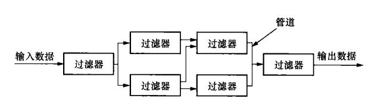

- 面向对象（数据表示和操作都被封装在抽象数据类型中，对象作为构件，是抽象数据类型的实例。对象与对象之间，通过函数调用和过程调用来进行交互）

  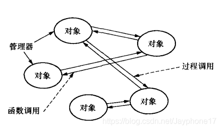

- 事件驱动（在当前系统的基础上，根据事件声明和发展状况来驱动整个应用程序运行）

  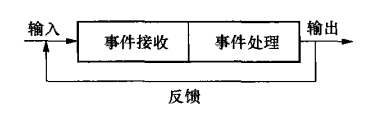

- 分层
  - 系统被划分为一个层次结构
  - 每一层高内聚，包含抽象程度一致的各种构件，支持信息隐藏
  - 将复杂系统系统划分为独立模块，简化程序的设计和实现
  - 通过分解，可将系统功能划分给明确定义的层，较高层面对特定问题，较低层具有一般性。下层为上层提供服务。

此外还有 **C2** 、 **数据共享** 、解释器 、 反馈控制环 、 **C/S** 、 **B/S** 、正交 、 **MVC** 体系结构风格。 详见[体系结构风格]([13种常见软件体系结构风格定义分析、结构图、优缺点_Jayphone17的博客-CSDN博客](https://blog.csdn.net/Jayphone17/article/details/103651076))

##### 引言

计算机体系结构：一组规则和方法用来描述计算机系统的功能，组织和实现。

产品线：指**一群相关的产品**，这类产品可能功能相似，销售给同一顾客群，经过相同的销售途径，或在同一价格范围内。确定产品线的最佳长度，能为企业带来最大的利润。

软件产品线：指用软件工程化的方法、工具和技术去从一组共享的软件资产集合创建一系列相似的软件系统。

体系架构为何重要？

- 影响一个组织的业务和技术各方面。
  - 业务方面包括：
    - 特定系统的软件（如Microsoft，利用架构控制市场，提供产品范围，专注商机，可用作销售工具）；
    - 企业体系结构（一系列系统的共同的基础架构）（缩短学习时间，指定支持工具，系统间分享架构成本）

体系架构影响因素：

- 开发组织结构
- 开发组织的企业目标
- 客户需求
- 技术和组织因素
- 架构师经验

客户作为系统开发的付费方关心

- 系统成本
- 系统的可用性和寿命
- 与其他系统的互操作性
- 发售时间
- 平台可移植性

最终用户是系统的使用者，包括普通用户，系统管理员，发展组织成员。关心：易用性，功能可用性

体系架构对开发组织结构的影响：

- 短期（工作单元围绕架构单元组织起来的，用于在建的特定系统）
- 长期（当公司构建类似系统的集合时，组织单元反映公共组件）

体系架构对开发组织目标的影响：

​	开发一个系统可以在市场利基中站稳脚跟。
​	以开发特定类型的系统而闻名成为一种营销手段。
​	架构成为额外市场机会和网络的杠杆点

体系架构对客户需求的影响：

- 对类似部署系统的了解会导致客户要求特定的功能。
- 客户将根据现有系统的可用性更改其需求。

架构和组织相互影响。架构的影响和来自架构的影响形成一个循环。
一个组织可以利用管理周期的好处。

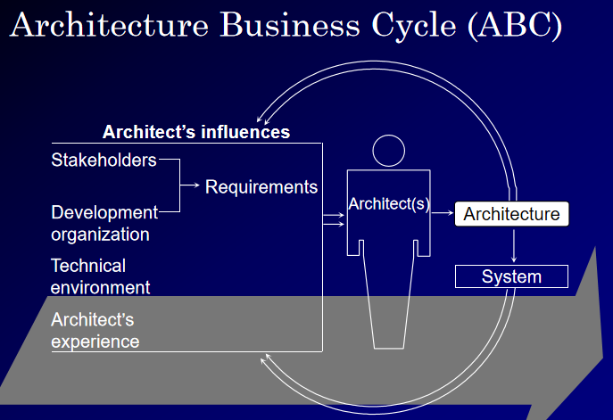

好的体系架构要有适用性、可在合理的预算和时间内实现。

##### 软件体系架构

定义：

程序或计算系统的软件体系结构是系统的一个或多个结构，包括软件组件、外在特征以及部件之间的关系。

隐含定义：

- 体系结构是多个系统的抽象
  - 定义部件和部件之间的交互关系
  - 要隐藏局部和细节的信息
  - 系统可有多个结构，单个结构不是体系架构。（备份结构不固定或预先描述任何有助于分析、交流和理解）
- 组件属性可由另一组件构成
  - 属性包括
    - 提供的服务（功能）
    - 所需服务
    - 性能特点
    - 故障处理
    - 共享资源使用
- 仅仅box-and-line图不是体系架构，而是开始点。
- 关系比链接器更普遍
  - 运行时，动态发生的信息交流（调用信号发送数据）
  - 非运行时存在的信息交流（继承）

- 每个系统有一个体系架构（系统由组件和它们之间的关系组成）；有一个架构与拥有一个众所周知的架构不同。

Reference Model 参考模型：

1. 参考模型是功能的分割，以及各部分之间的数据流
2. 参考模型把问题分成多个块，但并没有描述软件的方案

Reference Architecture 参考架构：把参考模型映射为软件部件，以及部件之间的数据流。

参考架构影响：组织开发队伍、现货使用、人力资源、成本进度等

Architectural Style 体系结构风格：

- **描述部件和连接器的类型，以及它们在运行时的控制 ‘与或’数据传递的模式**
- 体系结构风格**是对问题的体系结构解决方案**，这种方案是符合正规教义的—意味着，行业界都这么做
- 风格表达未完全说明的体系结构. 暗示着部件的运行交互和拓扑模式

风格：可被视作一组约束条件，一组相关体系结构的抽象。

- Client-Server
- Cooperation process
- Data-centered
- Layered

构建系统过程依赖：

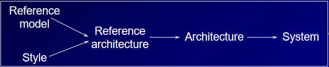

为什么体系架构重要？

- 共利方交流的平台（与用户协商需求，告知客户进程及成本，实现管理决策和分配）

- 早期设计决策的依据

  - 架构定义实现的限制（实现服从架构，资源分配决策约束单个组件的实现，在体系结构范畴进行系统权衡）
  - 架构决定了开发/维护工作的组织结构
  - 架构允许/阻止实现系统所需的质量属性
  - 通过体系结构预测系统质量属性是否能达标
  - 体系结构决定未来系统修改的工作量（局部单部件修改，多部件修改，系统拓扑结构、通信、以及协调关系的修改）
  - 帮助原型进化（哪些部件可插拔，分割功能到合适的部件，容易测试实验）
  - **constrains the implementation** 
    **organizes the development effort**
    **provides a first approach at achieving quality requirements**
    **helps manage change**
    **helps with prototyping**

- 系统移交、复用的抽象

  （架构是一种抽象，存在一对多的映射one architecture, many systems）

  1. 启用产品线
  2. 允许从外部开发的组件构建系统
  3. 将功能与互连机制分开
  4. 提供设计词汇表
  5. 支持基于模板的组件开发

体系架构结构：（A structure provides a view of the architecture）

- module(模块)：组件（模块，工作分配）关系：子模块，共享。
  - 作为团队分配和资源分配的基础（影响：可维护性、可理解性）

- process (进程)：组件（tasks, processes）关系：同步、互斥、

  抢占

  - 优化系统运行时性能，利用多处理器硬件（影响：性能）

  

- uses(使用)：组件（procedures 子程序，例程，函数）关系：假设存在

  - 设计子集，超集（影响：可复用性，可测试性，增量开发）

- calls (调用)：组件（子程序，例程，函数）关系：invokes(调用)

  - 用来跟踪控制流；用于调试（影响：可构建性、可测试性、可维护性、可理解性）

- data flow(数据流)：组件（programs, modules）关系：把数据送给...

  - 功能可追踪性（影响：性能，正确性，准确性）

- class(类)：组件（objects）关系：继承自，是谁的实例

  - 利用对象之间的相似性

- physical(物理)：组件（tasks，processes, processors）关系：驻留在同样的处理器上。

  - 管理进程与处理器的分配（影响：性能，可用性）

结构用来：

记录工具（for 当前，未来开发，管理者，客户）

工程工具帮助实现质量

一个大型系统的研究

- Behavioral Requirements（行为需求）
- Quality Requirements（质量需求）
- Architectural Approach（体系结构实现方法，如模块结构，use结构，进程结构）
- 模块结构——基本单位是模块
  - 模块构建原则
    - 识别出易修改的区域，作为单独模块
    - 模块封装那些可变的部分
    - 用接口定义那些不变的部分
    - 所有模块的使用都通过其接口上的设施进行
    - 隐藏数据结构、算法、和其他可变的部分
  - 三类修改
    - 硬件修改（新机器设备）
    - 需求行为修改（新功能、规则、模式）
    - 软件决策修改（新方法实现进程调度、数据类型、数据保存）
  - 三类一级模块（二级模块）（三级模块）（...）
    - 硬件隐藏模块（子模块：外设，接口，扩展计算机设备）
    - 行为隐藏模块（子模块：功能驱动模块，共享服务模块）
    - 软件决策隐藏模块（子模块：数据银行模块，物理模型模块，应用数据类型模块，过滤器行为模块，软件实用程序模块，系统生成模块）
  - 模块结构与开发团队结构
    - 任务分配：以第二层模块，划分开发小组
    - 文档组织：文档与模块对应，与其它结构文档分开
  - 模块内子模块的交互可以以数据流视图展示
    - 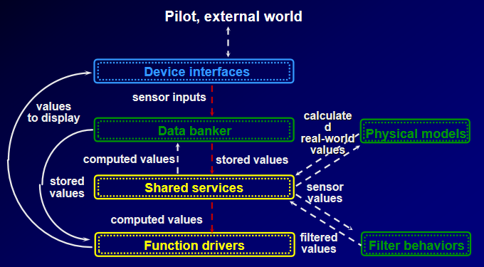

- 用例结构（use 结构）——基本单位是程序
  - （若程序A使用程序B，仅当B正确的工作，方能满足A的需求）
    - call（调用，可能只调不用）VS use（使用，可能不调即用）
  - 扩展（牵扯）一个程序A直至不再使用其它程序
  - 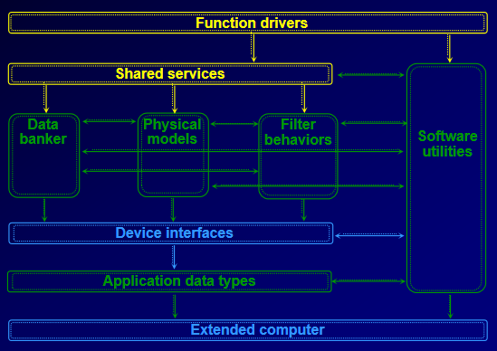
  - 分层风格（提供快平台的可移植性）
- 进程结构（process structure）——基本单位是进程
  - 进程驻留在功能驱动模块
    - 周期性进程：连续式
    - 非周期性进程：响应式
  - 处理器影响的并行与并发

这些结构是该系统的架构，每个结构为达到特定的质量属性实现，结构不允许仅发生在自己身上。

##### 系统质量

Software Qualities：质量是产品对其预期用途的适应性。（系统质量很大程度上依赖架构的选择）体系架构影响大多数质量，但并非所有质量的所有方面，体系结构只能允许，无法保证质量。

四类系统质量：（可观察可测量，可观察不可测量）

- 运行时的质量

  - 功能性：系统完成预期工作的能力。需要组件正确地交互、合作和同步。

  - 性能：响应时间，利用率，和系统的吞吐量行为。

    - 测量
      估计各种系统组件的环境和资源使用；
      使用分析模型、排队论和/或模拟来确定延迟、瓶颈和其他度量；

  - 安全性：衡量一个系统在向合法用户提供服务的同时，抵抗未经授权的使用尝试或行为修改的能力

    - 入侵检测的活动监控机制
    - 加密和解密
    - 入口点数的最小化
    - 安全内核和外壳
    - 测量：检验或估算方法，人们将试图确定系统将如何响应特定的攻击或误用场景。

  - 可用性（availability）：系统正常启动和运行的时间度量；两次故障之间的时间长度以及故障后恢复操作所需的时间长度。

    - 全系统错误恢复策略
    - 管理不可靠运输的规定
    - 关键部件冗余
    - 关键通信路径冗余
    - 热插拔
    - 活动性监控和故障报告
    - 用于触发、捕捉和传播错误的模板
    - 快恢复或启动功能

  - 易用性（usability）：终端用户训练学习使用的容易程度

    - 可学习性；效率（软件是否与用户的任务同步）；影响（用户感觉）；帮助性（能否很好地沟通并帮助用户解决问题）；控制（用户是否觉得软件响应正常且一致）

  - 互操作性：两个或多个系统运行时合作的能力。

    - 最小化组件的外部复杂性（即接口、环境、假设、前后条件）

      有限的交互机制和协议集

      通用命名方案的存在性

      服务设施名称

      仔细注意组件接口

- 非运行时的质量

  - 可修改性：软件系统能够适应软件更改的方便性。

    - 一致的功能分解和功能分配
      使用（少量）模式
      一致的功能封包
      信息隐藏与抽象
      分层
      分离数据的生产者和消费者

  - 便携性：系统在不同计算环境下运行的能力。这些环境可以是硬件、软件或两者的组合。

    - 平台/网络独立的层
    - 接口标准使用

  - 可复用性：现有组件在新应用程序中可重用的程度。重用组件减少了新系统的上市时间和成本。

    - 模式的正规化与最小化
    - 创建应用程序框架
    - 创建产品线体系结构

  - 可集成性：使各自开发的系统组件正确的一起工作的能力

    - 接口假设最小化
    - 有限的交互机制/协议集

  - 可测试性：软件易于显示其故障程度

    - 自我监控、捕获、回放和报告机制

      专用执行环境（如嵌入式系统）

      打包的模拟工具，测试工具（帮助评估代码覆盖率和条件覆盖率）

      行为形式化规范框架
      监控调试设施
      一致性错误处理方案

- 业务质量

  - 成本
  - 发售上市时间
  - 项目生存期
  - 遗留系统的利用
  - 适销性

- 体系架构质量

  - 概念完整性：一个系统是由少量的体系架构构成的，这些架构以少量的方式相互作用。（通过单一架构或小型合作良好的架构团队）
  - 正确性/完整性
  - 可建造性，可行性

##### 架构风格

体系结构风格是部件类型和其运行时的控制（与/或）数据转移模式的描述。

一个风格应是：

- 可重复
- 一个设计选择包（a package of design decisions）
- 已知可复用的特征
- 一类体系结构

决定风格因素：

- 组件类型（数据仓库，进程，对象）
- 组件的拓扑布局
- 一组语义约束（不允许数据存储库更改存储的值）
- 一组交互机制（子例程调用，事件，管道）

一个系统中会有多种风格。

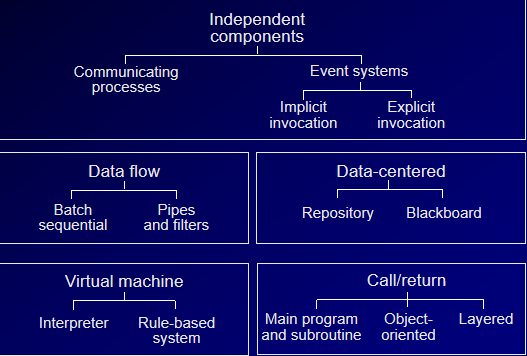

**数据中心风格**（访问和更新广泛访问的数据存储的系统）

目标：集成性，可扩展性（新客户/数据容易添加）

示例：

- 被动数据存储：存储库样式
- 活动数据存储：黑板样式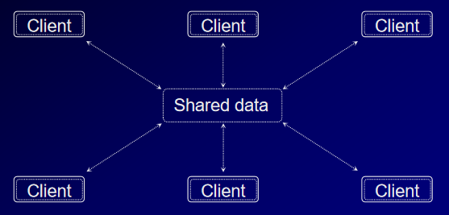

**虚拟机风格**

目标：模拟非本机功能以实现可移植性或原型化

示例：

- 解释器
- 基于规则的系统
- 命令语言处理器

调用/返回风格（call / return）

目标：根据子风格变化

子风格：

- 主程序/例程
  - 复用，独立开发
  - 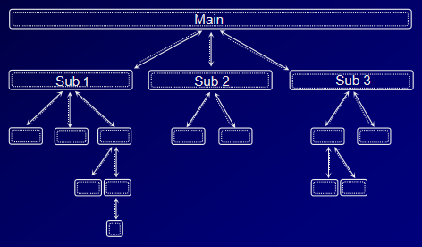
- 面向对象/抽象数据
  - 真实世界的自然建模
  - 增量复用
  - 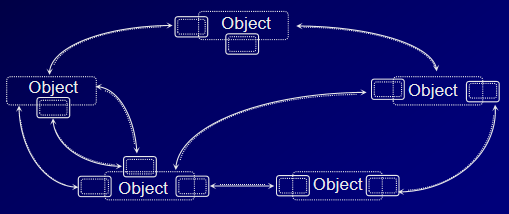
- 层次模式
  - 可移植性，复用
  - 如OSI开放系统互联参考模型
  - 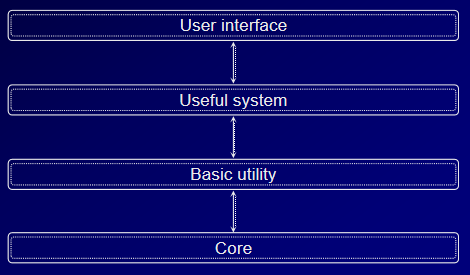

异质系统：很少有系统仅有一种风格构成，大多是多种风格的异构混合而成。

三类异构系统：

- 局部异质（系统不同的部分采用不同的风格）
  - 如进程风格和调用/返回风格结合的A-7E飞控系统
  - 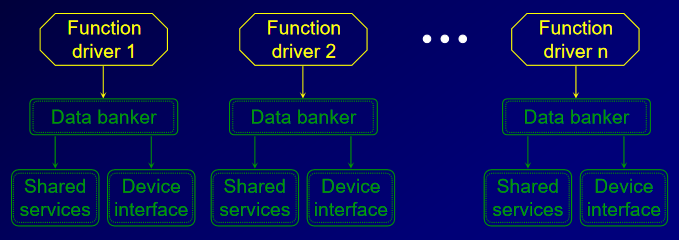
- 并发（不同风格相互重叠）
  - 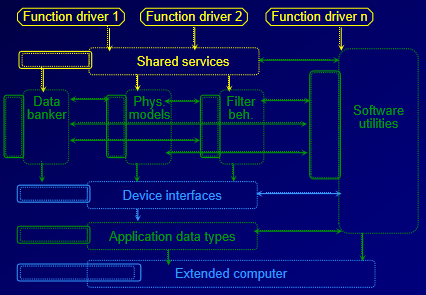
- 分层（一种风格的部件，由不同风格实现）
  - 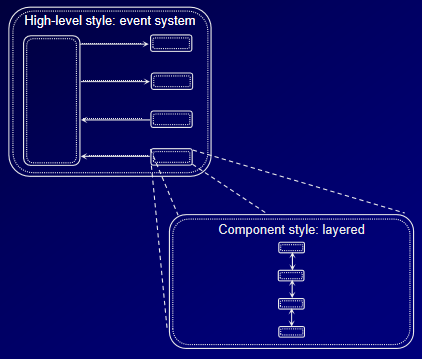

一个变换字符串顺序的系统展示：

- 管道/过滤器
  - 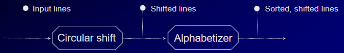
- 共享内存
  - 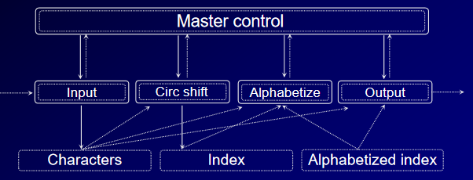
- 抽象数据（适应数据类型易变的情况）
  - 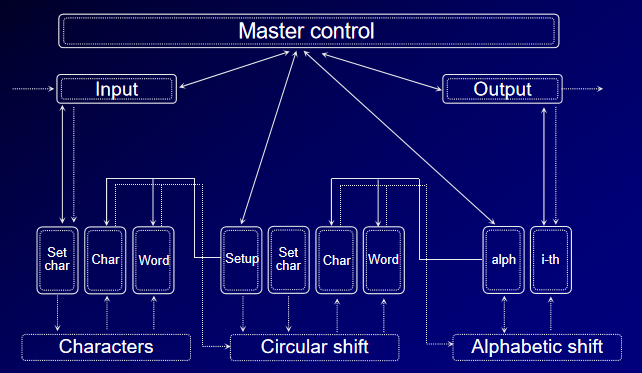
- 隐式调用
  - 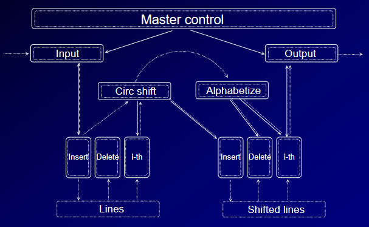

数据流风格常用于

- 输入输出关系易于明确，能够按顺序理清楚，输入与时间无关。
- 易于集成，部件之间的接口相对简单

数据流子风格常用于

- 输入和输出以再现序列发生，序列成员之间直接对应
- 连续数据流的计算和转换
- 闭环控制
- 用于嵌入在设备中，控制和调试不可预测的行为

调用/返回风格

- 计算固定
- 部件不会随其他部件的请求而发生变化

独立部件风格

- 运行于多处理器平台上
- 可被构造为一组松散耦合的组件
- 性能调优（进程间工作分配）
- 性能调整（进程处理器分配）

通信进程：用消息传递，作为交换机制

轻量进程：访问共享数据，满足性能要求

分布式对象：面向对象和交互进程

广播：所有的部件要经常同步，满足可使用性要求

事件系统：用信号解耦事件，用事件触发进程

数据中心风格

- 中心问题是大量长期数据的存储、展示、管理和检索
- 事务数据库/仓库：组件的执行顺序由访问/更新数据的传入请求流决定，并且数据是高度结构化的
- 黑板：不改变生产者的情况下，添加数据消费者以实现扩展性，更改谁生成的和使用哪些数据的形式实现可修改性。

虚拟机风格

Java 虚拟机（设计了计算，但没有固定的执行机器）

可移植性：例如隐藏操作系统的详细信息以允许操作系统的更改，或隐藏用户界面工具箱的详细信息以允许工具箱的更改。

##### 战术实现

战术可重定义其它的战术

模式打包策略（一个支持可用性的模式集成使用冗余战术和同步战术）

**可用性策略**（availability tactics）

- 错误检测

  - ping/echo
  - 定时器（一个组件周期性发心跳消息，另一个周期性接收）
  - 中断

- 错误恢复

  - 投票（大多数原则）
  - 冗余（TMR 三模块冗余，一个输出不同，其输出被忽视并被认定为失效故障。 N-version 编程； 恢复块）

  

  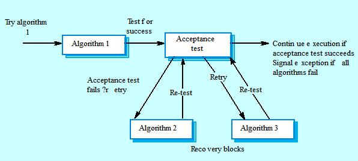

  - 备份
  - 影子操作
  - 状态重新同步
  - 检查点回滚

- 错误预防

  - 停止使用服务
  - 事务（事务是几个连续步骤的绑定，这样整个绑定就可以一次撤消。）
  - 过程监视器

可用性总结：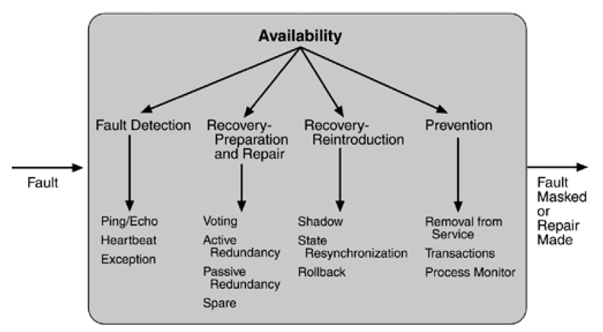

**可修改性策略**（modifiability tactics）

- 局部化修改
  - 语义内聚
  - 预测未来的修改
  - 模块通用
  - 限制可能的选项
- 防止涟漪效应（由改变A所导致的对B的修改）
  - 隐藏信息
  - 维护现有接口
  - 限制通信途径
  - 使用中介（数据仓库，服务，接口标识）
- 延迟绑定时间

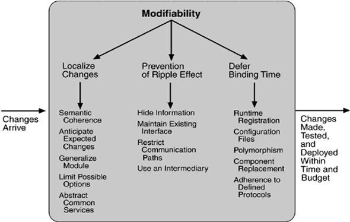

**性能策略**（系统在特定时间限制内对到达事件的产生响应）

关键在于资源消耗和阻塞时间

三个策略

- 资源请求
  - 降低处理一个事件所需要的资源（增加计算效率，降低计算负载）
  - 降低处理事件总量（管理事件速率，控制采样频率）
  - 降低或管理包含控制资源使用的需求（限制执行时间，限制队列大小）
- 资源管理
  - 引入并行
  - 维持数据或计算的多个副本
  - 增加可用的资源
- 资源仲裁
  - 调度策略
    - FIFO（First in First out）
    - Fixed-Priority scheduling（按任务重要程度划分优先级）
    - Dynamic priority scheduling
      - round robin（轮询调度）
      - earliest deadline（最早截至时间优先）
    - Static scheduling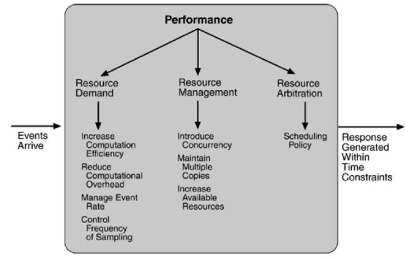

**安全策略**

- 抵御攻击
  - 甄别用户（密码，数字证书，验证码...）
  - 授权用户（用户有授予的权限）
  - 保持数据机密性（加密），完整性（编码冗余信息，保证原始数据完整如校验和、哈希值）
  - 限制暴露
  - 限制访问（防火墙）
- 检测攻击
  - 历史模式比对
  - 过滤包比对
  - 侵入检测器
- 攻击后恢复
  - 将系统或数据恢复到正确的状态
  - 保持审计跟踪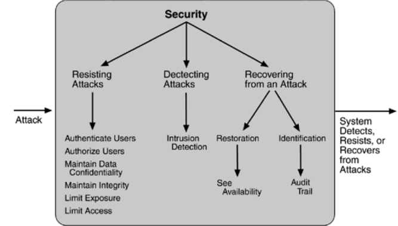

**可测试性策略**

- 输入/输出
  - 记录/写回
  - 接口独立于实现
  - 指定访问接口/路径
- 内部监视器
  - 可以维护状态、性能负载、容量、安全性或通过接口访问的其他信息。
  - 可以是组件的永久接口，也可以通过工具技术（如面向方面的编程或预处理器宏）临时引入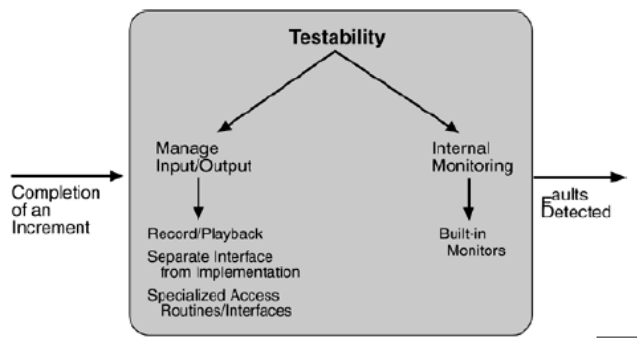

availability强调的是相应功能或特性存在与否，即有还是没有。

usability强调的似乎是用起来后的体验，即好不好用、方便不方便。

**易用性策略**（usability tactics）

- 运行时包括在系统执行期间支持用户的运行时间
  - 如取消，撤回，展示视图支持错误纠正和更有效的操作
  - 线下修改更正开发依赖过去用户行为
  - 维护一个任务模型，用户模型，系统模型
- 基于用户界面设计的迭代性质，在设计时支持界面开发人员。
  - 独立用户接口和应用的其他部分
  - 局部化期望改变是语义内聚的原则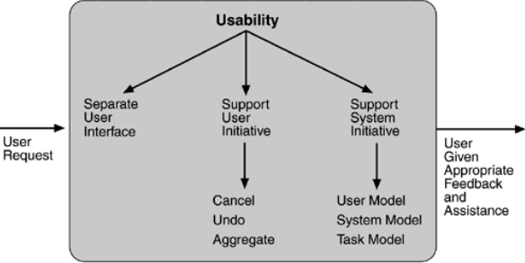

战术与体系架构模式的关系

信息隐藏，中间媒介，绑定时间（可修改性）

调度策略（性能）

ADD（Attribute-Driven Design属性驱动的设计）：设计一个体系架构既满足非功能性需求又满足功能性需求。

**ADD以一组质量属性场景（功能性需求，限制，质量属性需求）做输入**，利用质量属性实现与体系结构之间关系的知识来设计体系结构。

ADD是定义一种基于分解和反组合实现系统所实现的质量属性的进程的软件架构的方法。一种迭代分解的过程，每个阶段战术和架构模式被选择来满足一组质量场景，然后分配功能来实例化模式提供的模块类型。

**ADD的输出是架构的模块分解视图和其他视图的前几个级别**。

1.  选择要分解的模块。
2. 优化模块
   1. 选择具体的质量场景和功能需求，作为**体系结构驱动**源
   2. 选择能满足该驱动源的**体系结构模式**。基于战术，创立或选择模式，标识要实现这些**战术**对子模块的要求
   3. **模块实例化**，从多个视角，通过用例给其**分配功能**
   4. 定义子模块之间的接口。说明模块类型、交互关系和约束条件。把每个模块间的接口信息写成**文档**
   5.  **验证和细化** **用例和质量场景**，并使子模块满足**质量约束**。本步骤验证哪些是不重要的，为后续的分解做好准备。
3. 对每个模块重复上述步骤进一步分解（系统->子系统->子模块）
4. 形成开发团队
5. 构建系统框架

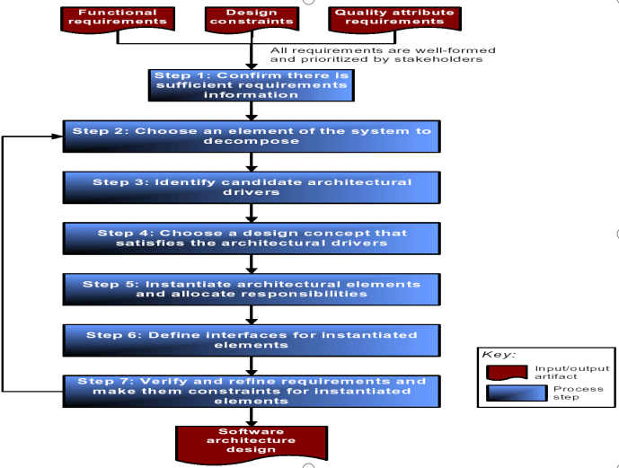

##### 软件架构构建步骤

1. ABC（架构业务循环）
2. 系统需求
3. 初始质量需求
4. 后续质量需求
5. 体系结构视角（4+1视图模型）可从物理视角、模块分解视角、进程视角、客户-服务器视角、代码视角、层级视角、容错视角等考虑

**文档化体系架构**

\1. 代表客户方的架构师和需求工程师：在相互竞争的需求之间进行谈判和权衡。

\2. 组成部分的架构师和设计师：解决资源争用并建立性能和其他类型的运行时资源消耗预算。

\3. 系统开发人员：为下游的开发活动提供不可侵犯的限制。

\4. 系统集成测试人员：指定必须组合在一起的部件的正确黑盒行为。

\5. 运维人员：揭示一些潜在变化可能会产生的影响。

\6. 产品线经理：确定产品系列中潜在的新成员是否在范围内或者超出范围的话，超出了多少。

\7. 质量属性专家：提供实时的调度分析器、仿真和仿真生成器、定理证明器、验证器等分析工具的驱动模型，这些工具需要有关资源消耗等的信息。体系结构文档必须包含评估各种质量属性所需的信息。对每个属性的分析都有自己的信息需求。

\8. 项目经理：创建与以确定的工作分配相对应的开发团队，规划和分配项目资源，并跟踪各个团队的进展情况。

\9. QA团队：为一致性检查提供基础，以确保实现忠实于体系结构的处方。

UML （模块视图）

模块

聚合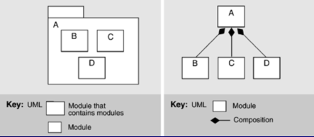

泛化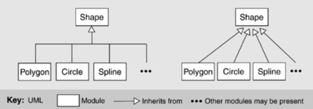

依赖

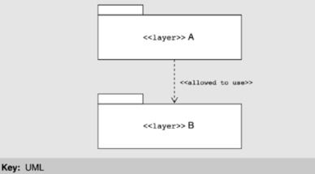

WWW非功能实现

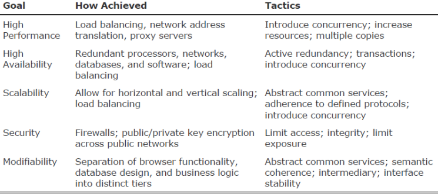

##### 软件产品线

根据架构构建系统

- 形成组织架构
- 创建系统的骨架版本
- 使用设计模式
- 检查一致性

产品线：使用体系结构作为构建一组相关产品的基础，这些产品共享一组托管的特性，这些特性共同满足特定的市场细分。

基于组件的系统开发：使用架构作为框架，在其中插入可替换组件。

两者关系：

基于组件的开发是产生基于体系结构的产品线的一种方法。

产品线通过更换分立元件来实现不同的功能。单个系统（产品）是中央核心系统的修改。

产品来源于：定制架构，实例化可定制组件，组装集成继承而非编码构建。

可复用的潜力存在于：

- 体系架构
- 软件组件和遗留系统
  - 需求和设计
  - 文案文档
  - 算法
  - 测试方案，测试用例，测试结果
- 专家人员和他们的经验
- 业务和管理资产
  - 规划和预算
  - 市场营销文化
  - 过程和工具

复用的好处：

- 降低缺陷。降低未知风险发生的可能性
- 性能。解决所有产品的性能问题
- 计划：更准确，因为所有产品的生产方式都是一样的
- 减少上市时间，人员配备

产品线的问题：

第一个产品的成本过高

产品的进化与产品线进化的同步问题

组织：核心资产的单元应与生产产品（并向客户报告）的单元分离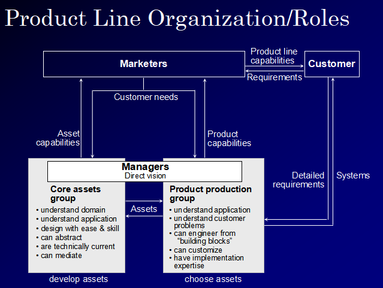

基于组件的开发（Component-based development）

优点：

快速采用新产品/技术
缩短上市时间
保持高生产率：重用/集成，而不是代码/测试
专注于应用领域、需求
使用更可靠的部件
产生可变的、可扩展的系统

缺点：

组件的性能，安全性，可靠性，质量直到使用后才能确定。

不兼容可能在系统部署之后才会出现，并且可能很难或不可能解决。

产品进化失控，非想要的。

供货商倒闭

体系结构不兼容，不匹配。

体系架构对于建造一个基于组件系统的系统是基础的。

- 体系结构确定要买/建的组件
- 确定组件需求

由于体系结构的不匹配组件集成可能很麻烦。针对不匹配：检测，修复。

基于组件的系统在成熟的领域是可能的。
成熟的领域具有标准的、有良好文档记录的参考体系结构。
编译器
数据库管理系统
操作系统
网络通信系统

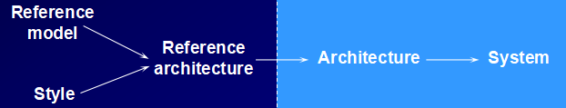

参考模型来源于：

研究者的抽象欲望
客户对系统比较基础的需求

产生：

问题的共识
工作分配的第一近似值

参考架构来源于：产品开发者，标准组

产生：

可互换部件
互操作组件

组件生成器来自产品开发组织。
组件生成器可以快速生产可定制组件。
应用程序生成器来自产品开发组织。
应用生成器可以快速生成系统。